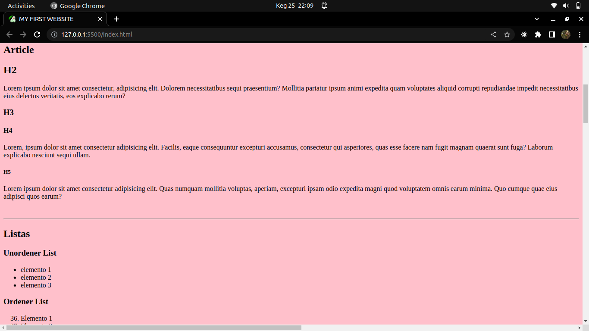
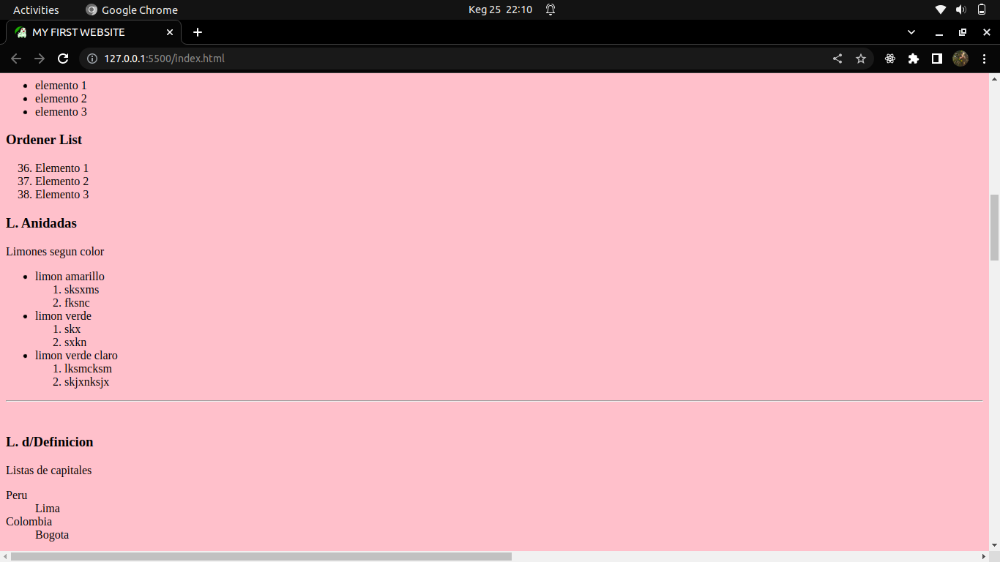
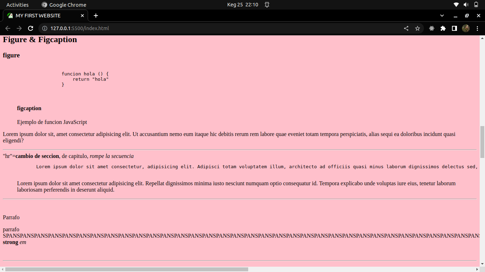
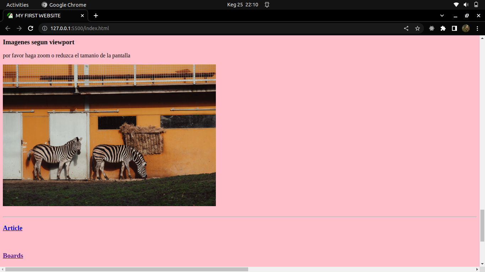
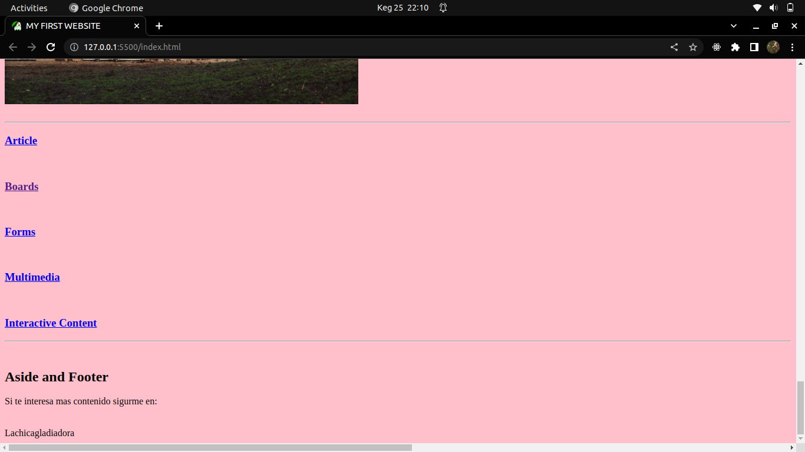

# Learning HTML
Guide to learn, remember and feedback knowledge in HTML

## Content
- title
- icon: short cut icon
- h1, h2, h3, h4, h5, h6
- header - image
- nav and links
- article
- paragraph
- 
- lists
  - unordered list
  - ordered list
  - nested lists
  - 
- figure and figcaption
  - code
  - pre
- main
- blockquote
- div and span
- 
- subfolder
- images
  - 
- article with other page
- boards
- forms
- multimedia 
- interactive content
- 

